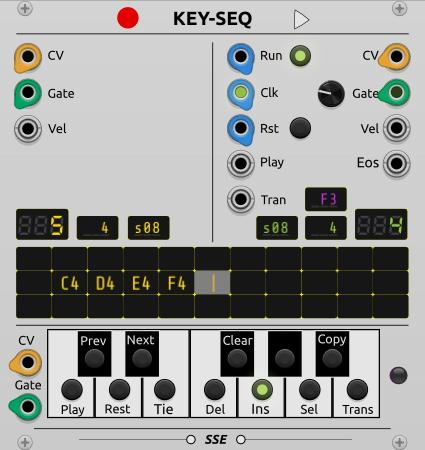
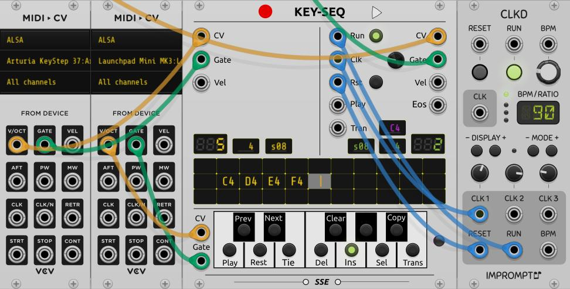
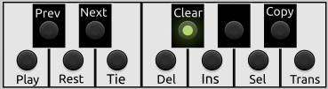
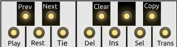
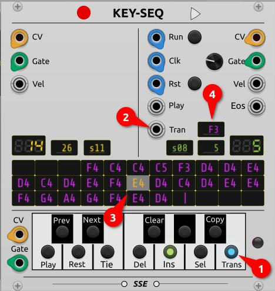
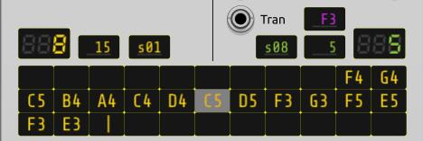

# KEY-SEQ

KEY-SEQ stands for Keyboard-Sequencer. Sequences can be entered with a MIDI keyboard and the same keyboard can also be used to control the sequences.
This means you can start 

- playing a sequence
- transposing a sequence
- switching to an other sequence

with the MIDI keyboard.

This makes KEY-SEQ perfect for live performances and improvisations.

Here you can find a Demo Video: https://www.youtube.com/watch?v=0zP2XU9faUw

## Features

- 12 sequences with a maximum of 256 steps.
- Capturing notes, tied notes and rests
- Transpose function for sequences

## Basic principle

The following sequences are present in KEY-SEQ sequences

- 12 Record sequences
-  1 Play sequence
-  1 Transpose sequence

The *record sequences* are recorded from the keyboard.
One of the 12 *record sequences* is the **current** *record sequence*.
Pressing a key on the MIDI keyboard will add or alter a step of this sequence.
The current *record sequence* can be copied into the *play sequence*
using the **Play** command. The steps of this sequence will then be played on the
outputs of the module.

With the **Sel** command another of the 12 *record sequences* can be selected
and becomes to the current *record sequence*.

The last *record sequence* (number 11) is special.
It is not copied into the *play sequence*, but into the *trans sequence* using
the **Play** command.
The *trans sequence* determines the base note of the *play sequence* to transpose.
After each pass through the *play sequence* the next note of *trans sequence* will be used
as base note.

## Usage

A base patch

The *Run*, *Clk*, *Rst* inputs have to be connected to a clock module that supplies the clock
and via which the sequencer can be started and reset. Starting and resetting
can also be done using the corresponding switches on the module.
The *Run* and *Rst* inputs are therefore optional.

The values of the play sequence are present at the *CV*, *Gate* and *Vel* outputs.
The *Gate* control can be used to the set the length of the gate signal .

The *CV*, *Gate* and *Vel* inputs have to be connected to a *MIDI->CV* module
or to a module which provides similar signals.

Both *Vel* signals are optional.

Make sure the record button is on (red light). This is the default setting.

Now a sequence can be entered into the current *record sequence* using
the connected MIDI keyboard and the MIDI keyboard can be used to control the modul.

## Controlling With Commands

The the commands can be triggered in different ways:

- with the buttons on the virtual keyboard of the module
- with key combinations of the connected MIDI keyboard
- with keys of a second connected MIDI keyboard

The following commands are available:

- **Play** : copies the current *record sequence* into the *play sequence*.
- **Prev** : moves the input position of the current *record sequence* one step forward.
- **Next** : moves the input position of the current *record sequence* one step backward.
- **Rest** : adds a rest to the current *record sequence*.
- **Tie**  : adds a tied note to the current *record sequence*.
- **Del**  : deletes a note from the current *record sequence*.
- **Clear** : deletes all notes from the current *record sequence*.
- **Ins**   : switches the **insert mode** on and off: notes will be inserted or overwritten.
- **Sel**   : starts selecting an other record sequence.
            Every following key (or button) stands for one of 12 sequences.
            To select it, the key (or button) has to be pressed.
- **Copy**  : Copies the current *record sequence* into an other *record sequence*.
        The target sequence has to be selected with a key (same as *Sel*).       
- **Trans** : switches the **transpose mode** on and off:
        the note from the keyboard is not recorded in the sequence
        and is used instead to transpose the *play sequence*.

## Commands With The MIDI Keyboards

You can connect two MIDI keyboards (or similar devices) via a MIDI->CV module to KEY-SEQ.
The first keyboard has to be connected to the the upper inputs (CV, Gate, Vel)
and for the second optional keyboard the lower inputs can be used.

**Pressing and releasing** a key on the first MIDI keyboard means adding a step to the
current *record sequence*.

A command can be triggered by **pressing and holding a key and pressing an other key**
without releasing the first key.

The virtual keyboard shows which key means which command. For example C4 means **Play**.

Apart from the commands **Prev** and **Next**, the octave has no meaning. For these
commands the octave determines the number of steps:

- octave < 4 : 1 step
- octave > 4 : 11 steps (one row)
- octave = 4 : 5 steps

The second MIDI keyboard will be used only for commands. On this keyboard a command will
be executed by pressing a key. No key combination is needed.

So you can use one keyboard for the steps and the other keyboard for the commands.

## Meaning Of The Lights

Pressing a key shows the white light on the virtual keyboard.
So you can see, which command will executed if you press a second key or
which step will be entered if you release the key.

After executing the **Sel** or **Copy** command, all lights are yellow. 
This means that you can select the target sequence by a key or a button press.

Other lights on the virtual keyboard have the following meaning:

- **Play** - Yellow means: waiting for copy.
    In this case the **Play** command was executed, but the but the module waits for the end of the current sequence.
    When the new sequence was copied the yellow light disapears.
      
- **Clear** - Green means: the current record sequence is empty. With the first entered note the light will be switched off.

- **Ins** - Green means: the insert mode is on.

- **Trans** - Blue means: the transpose mode is on.

## Copy And Play A Sequence With A CV Signal
    
To copy and play a sequence the input *Play* can be used instead of a command. 

The voltage on this input has to confirm the 1V/oct standard or has to be 1..10V (see Options).
If the voltage changes then the corresponding record sequence will be copied into
the play sequence.

## Transposing The Play Sequence

There are three ways to change the transposing of the play sequence, each with a different priority.
Which is currently used, can be determined on the color of the base note, which is displayed on the module (4).

The highest priority has the transpose mode, which can be switched on and off
using the **Trans** command (1).
If it is switched on, it determines the base note for transposing from the note entered on the (first) MIDI keyboard.
The note is shown in yellow in the Trans display after a key was pressed
and then in blue as soon as it is activated at the end of the play sequence.

The *Trans* input has the second highest priority (2). When the voltage on this input changes, the resulting note
(according to 1V/Oct) is set as the base note for transposing. The note will appear
in yellow in the Trans display after the voltage changed and it
will appear in green when it is activated.

If neither the transpose mode is on nor the *Trans* input is used, then the base note
for transposing is determined from the transpose sequence.
This sequence can be filled by copying the record sequence 11 (3) with the **Play** command.
The current base note is shown in purple in the Trans display.

If the trans sequence is empty, then C4 is used as the base note
for transposing and is shown in white on the display.

## Displays

Yellow displays are used for the current record sequence and green displays are used for the
play sequence.

The big displays on left and right side show the current step of the sequence.
The small displays on the side show number of steps. The displays in the center show the
number of the sequence (s00-s11). In case of the record sequence this is
the number of the current sequence. In case of the play sequence this is the number
of the last record sequence that was copied.

The large three line display below shows the current record sequence
(or part of it, depending on the length)
The current position is always in the center. This means that the **Next** and **Prev**
commands do not move the position in the display, but the displayed notes instead.
So 16 steps before and 16 steps after the current position are always visible.

Note values are represented by a letter for the note value and a number for the octave.
Rests are represented by the sign " ' " and tied notes
(which have the same note value as their predecessor) are represented by "\~\~\~".
The end of the sequence is marked with a " | ".

## Playing Keyboard ( and not the sequence)

... is also possible. Just switch off the *Record* button.

## Options In The Menu

- *Cmd from keyboard* : determines whether control is possible
  via the first MIDI keyboard (key combination). This option can be
  switched off when using a second keyboard or the buttons on
  the virtual keyboard for the commands.
                   
- *Cmd from last key* : if set, then the command is not determined by the first key pressed,
    but by the second key pressed.
                   
- *Autoplay when*

    - *new note*      : triggers the Play command when a (new) note is entered in the record sequence.
    - *new rest*      : triggers the Play command when a rest is entered in the record sequence.
    - *new tie*       : triggers the Play command when a tied note is entered in the record sequence.
    - *delete*        : triggers the Play command when a note is deleted from the record sequence.
    - *select sequence* : triggers the Play command when a other record sequence is selected.

- *Play CV 0..10V*    : Sets the range for the Play input for selecting the sequence to 0-10V instead of note range C-B.

- *Play input selects sequence*: Instead of copying a recording sequence into the playback sequence, a recording sequence is             selected. If "autoplay when select sequence" is set, then the sequence will also be copied into the play sequence.

- *Play after end of Sequence*: A record sequence is copied to the play sequence at the end of the sequence.
                        If the option is not set, copying takes place with the clock.

- *Transpose after end of Sequence*: The base note for transposition only takes effect at the end of the
                           end of the play sequence. If the option is **not** set, the base note
                           for transponation is set with the clock.

- *Set Sequence after copy*: If set then a record sequence will become the current record sequence after the **Copy** command.

